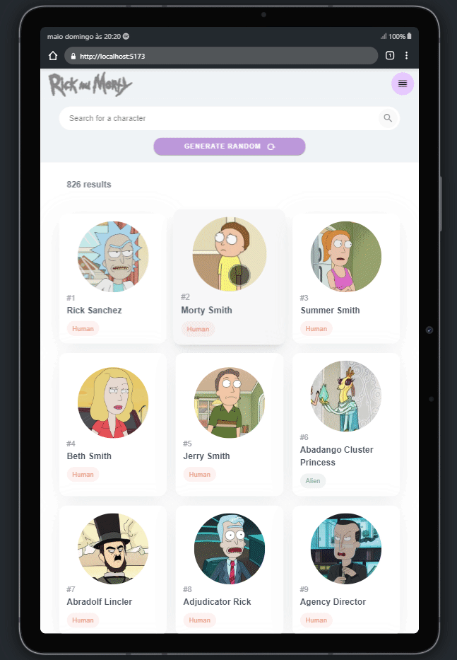

<h1 align="center">
    <br>
    
    <br><br>
    Rick & Morty Search
</h1>

<p align="center">
    A SPA study project with a design created by me, integrated with a free API available from Rick and Morty. It is a site that can be used by artists or curious people to search characters by name, or by category, and learn more about the drawing and even be surprised by the randomly generated character.
    <br><br>
    <a href="https://opensource.org/licenses/MIT">
        
    </a>
    <br><br>
</p>

[*🎯 Roadmap*](./ROADMAP.todo) | [*👀 Project*](https://linktoproject)

## ✨ Features

- Mobile First
- List and open details
- Search and filter
- Pagination

## 📸 Preview
<div align="center">

  

  <br>

  

  <br>

  

</div>
<br>

## ⚡ Tech Stack

### Client
 Vue.js 3,  TypeScript,  Tailwind,  Vuetify 3

### Server

 [API GraphQL - Rick and Morty](https://rickandmortyapi.com/)

<br>

## 🗂 How to Use

Run Locally
```bash
# Clone the project
  git clone https://github.com/Merieli/rick-morty-search.git

# Go to the project directory
  cd rick-morty-search

# Install dependencies
  npm install

# Start the server
  npm run dev
```

Work
```bash
# Generate first release:
  npm run release -- --first-release

# Generate release patch
  npm run release:patch

# Generate release minor
  npm run release:minor

# Generate release major
  npm run release:major

# Run tests
  npm run test

# Commit changes
  npm run commit
```

## :octocat: Contributing

This project is for study purposes, so contact me and let me know your ideas.
All kinds of contributions are very welcome and appreciated!

- ⭐️ Star the project
- 🐛 Find and report issues
- 📥 Submit PRs to help solve issues or add features
- ✋ Influence the future of project with feature requests

-------------------------------------
```diff
Made by 🤍 Merieli Manzano
```

<p align="right">(<a href="#top">back to top</a>)</p>
